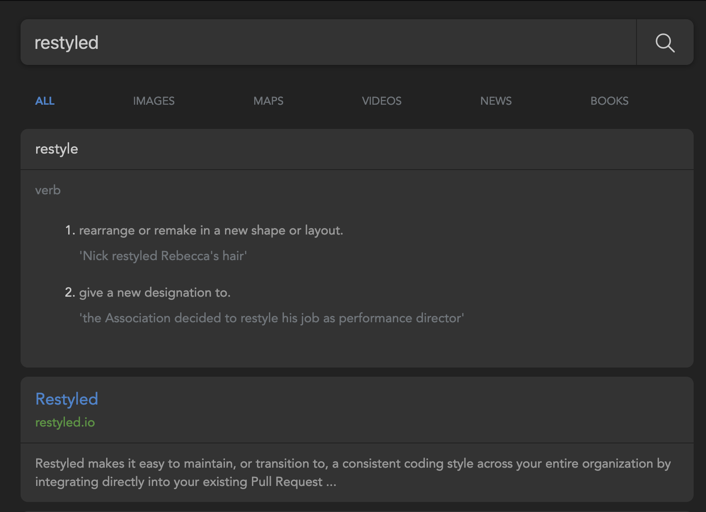

# Whoogle Search - simplified

This is a fork of [Whoogle Search](https://github.com/benbusby/whoogle-search) stripped down of all settings, autocomplete and other weird scripts. Just 1 dark style and the bare minimum.




# Installation
```sh
git clone https://github.com/tborychowski/whoogle-search.git
cd whoogle-search
docker-compose up -d
```
